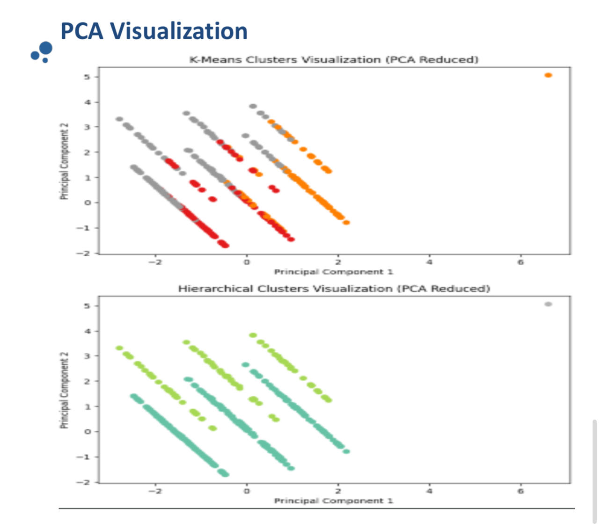
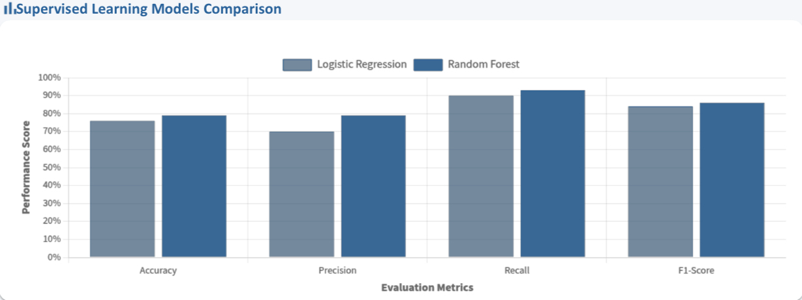
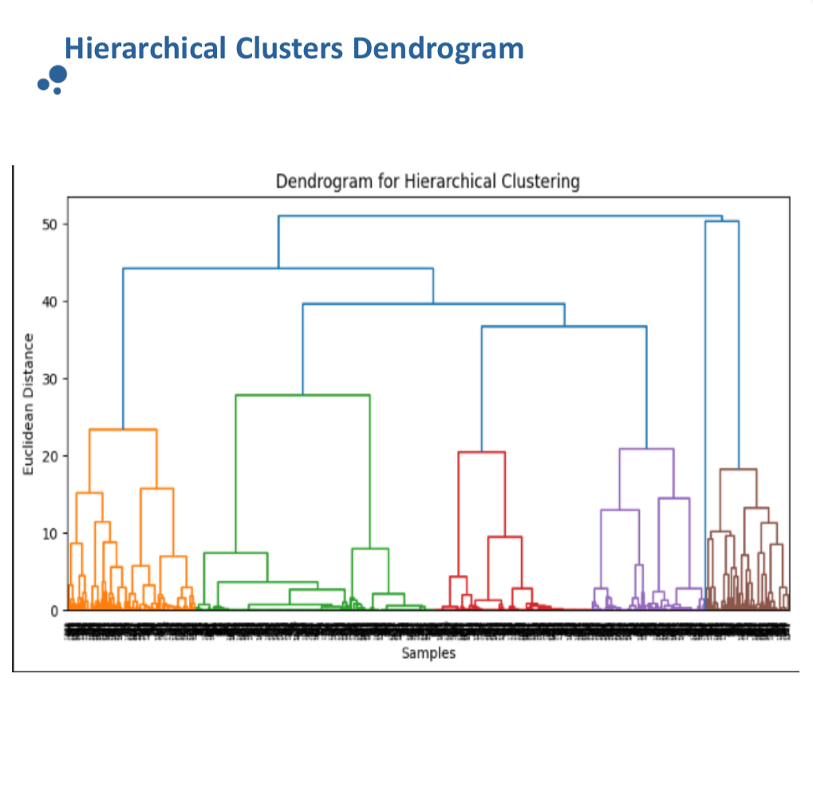
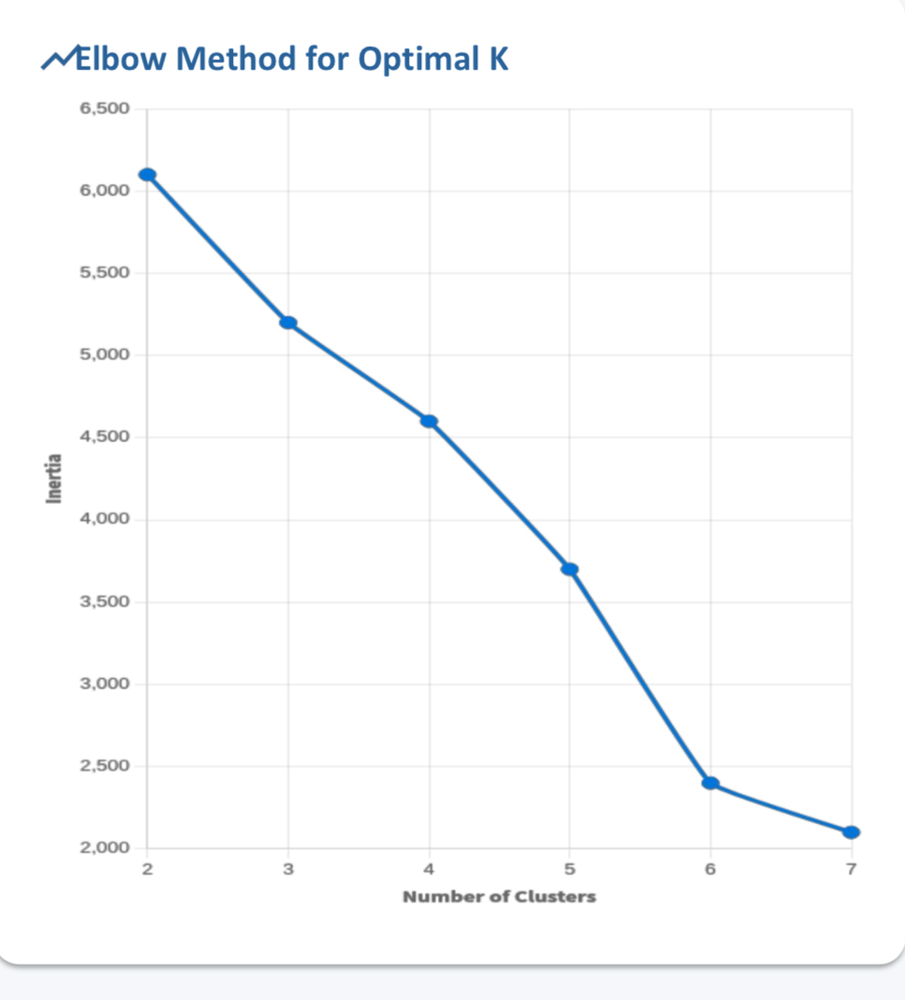

# Machine-Learning-Project

MENTAL HEALTH IN TECH SURVEY – MACHINE LEARNING ANALYSIS
======================================================

PROJECT OVERVIEW
----------------
- Purpose:
  Analyze mental health trends among professionals in the technology sector
  and identify factors influencing mental health treatment decisions.
- Approach:
  Apply supervised and unsupervised machine learning techniques to extract
  insights and build predictive models.
- Outcome:
  Compare multiple models to determine the most effective approaches.

DATASET
-------
- Source:
  Kaggle – Mental Health in Tech Survey.
  - Dataset Link:
  https://www.kaggle.com/datasets/osmi/mental-health-in-tech-survey
- Size:
  1,259 survey responses from tech professionals.
- Target Variable:
  treatment (Yes / No).
- Feature Types:
  Demographic, workplace, and mental health-related features.

DATA PREPROCESSING
------------------
- Data Cleaning:
  Removed duplicate records and handled missing values in key columns.
- Feature Encoding:
  Applied One-Hot Encoding and Label Encoding for categorical variables.
- Feature Scaling:
  Standardized numerical features using StandardScaler.
- Feature Selection:
  Selected relevant features to improve model learning.

SUPERVISED LEARNING MODELS
--------------------------
- Logistic Regression:
  Linear baseline model for classification.
- Random Forest Classifier:
  Tree-based ensemble model capable of capturing non-linear patterns.

EVALUATION METRICS
------------------
- Accuracy:
  Overall correctness of predictions.
- Precision:
  Correctness of positive predictions.
- Recall:
  Ability to identify actual positive cases.
- F1-score:
  Balance between precision and recall.

SUPERVISED LEARNING RESULTS
---------------------------
- Logistic Regression:
  Achieved approximately 76% accuracy.
- Random Forest:
  Achieved approximately 79% accuracy with higher F1-score.
- Interpretation:
  Random Forest outperformed Logistic Regression due to non-linear relationships.

UNSUPERVISED LEARNING MODELS
----------------------------
- K-Means Clustering:
  Distance-based clustering for pattern discovery.
- Hierarchical Clustering:
  Reveals multi-level cluster structure.

UNSUPERVISED LEARNING RESULTS
-----------------------------
- K-Means:
  Silhouette Score ≈ 0.32.
- Hierarchical Clustering:
  Silhouette Score ≈ 0.35.
- Interpretation:
  Hierarchical clustering produced clearer participant groupings.
-----------------------------
## Data Visualizations

### PCA Visualization
  
The dataset was reduced to 2 dimensions using PCA for visualization, showing clusters identified by K-Means and Hierarchical Clustering.

### Model Performance Comparison
  
Comparison of Logistic Regression vs Random Forest based on Accuracy, Precision, Recall, and F1 Score.

### Hierarchical Clusters Dendrogram
  
Dendrogram illustrating the hierarchical structure of participant clusters.

### Elbow Method
  
Used to find the optimal number of clusters for K-Means clustering.

### Combined Model Performance Comparison
  
Comparison of supervised (Accuracy) vs unsupervised (Silhouette) model performance.
------------

KEY INSIGHTS
------------
- Mental health treatment decisions involve complex feature interactions.
- Tree-based models outperform linear models on survey data.
- Hierarchical clustering reveals meaningful data structure.

CONCLUSION
----------
- Random Forest is the strongest supervised model.
- Hierarchical Clustering provides better unsupervised insights.
- Combining both approaches improves overall understanding.

## Group Members

This project was completed as a group effort by my team members :

- [@layanKhalid0](https://github.com/layanKhalid0)
- [@LamaTurki8](https://github.com/LamaTurki8)
